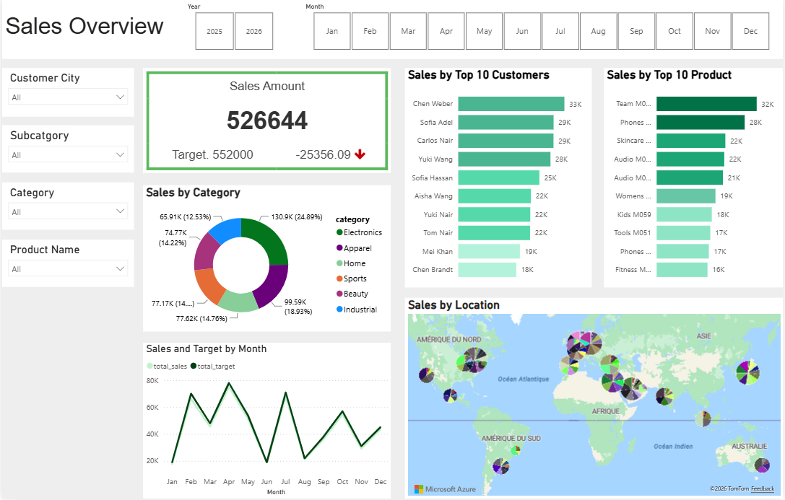
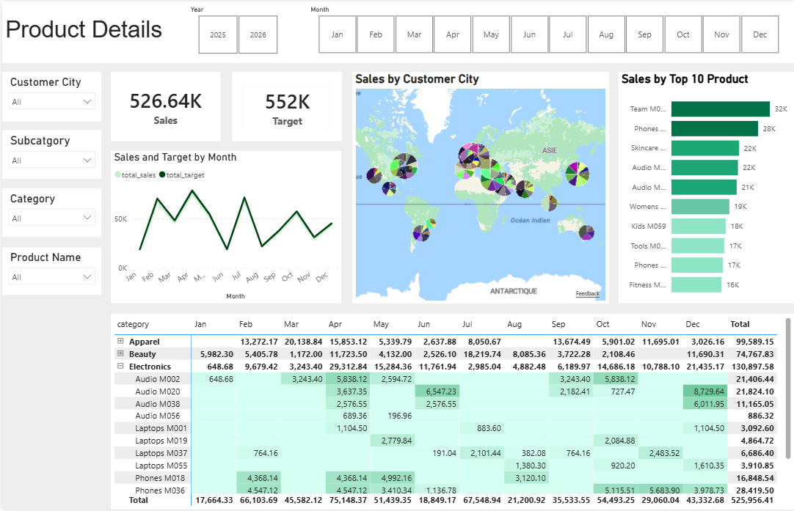
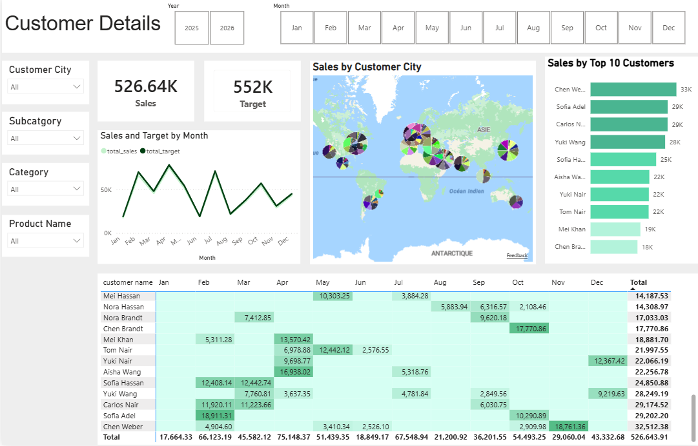

# 📊 Sales Analytics & Business Intelligence — Power BI

> **Transforming raw sales data into actionable insights on revenue, products, customers and sales performance.**

An end-to-end **Sales Analytics and Business Intelligence project** developed with Microsoft Power BI to transform raw sales data into an interactive decision-support dashboard.

The project focuses on three complementary perspectives:

* **Sales Performance**
* **Product Performance**
* **Customer Analysis**

---

# 🎯 Business Problem

A sales organization generates large volumes of transactional data, but raw sales records do not provide an immediate understanding of business performance.

Management needs to quickly answer questions such as:

* How is overall sales performance evolving?
* Which products generate the most revenue?
* Which products contribute most to sales volume?
* Which customers generate the highest value?
* How is revenue distributed across customer segments?
* Which periods or categories perform better?
* Where are the strongest opportunities for increasing sales?

Without a centralized analytical solution, these questions require manual analysis of raw datasets, making it difficult to identify trends and support timely decisions.

### Business objective

Build a **single interactive analytical solution** that transforms transactional sales data into clear insights about:

**Sales → Products → Customers → Business Performance**

---

# 💡 Solution

I developed an interactive **Power BI sales analytics dashboard** following a complete BI workflow:

```text
                 RAW SALES DATA
                       │
                       ▼
              ┌─────────────────┐
              │  POWER QUERY    │
              │                 │
              │ Data Cleaning   │
              │ Transformation  │
              │ Data Preparation│
              └────────┬────────┘
                       │
                       ▼
              ┌─────────────────┐
              │  DATA MODELING  │
              │                 │
              │ Relationships   │
              │ Data Structure  │
              └────────┬────────┘
                       │
                       ▼
              ┌─────────────────┐
              │      DAX        │
              │                 │
              │ Business KPIs   │
              │ Calculations    │
              └────────┬────────┘
                       │
                       ▼
              ┌─────────────────┐
              │    POWER BI     │
              │    DASHBOARD    │
              └────────┬────────┘
                       │
                       ▼
              BUSINESS INSIGHTS
```

The solution transforms the raw dataset into an interactive dashboard where users can explore sales performance from different business perspectives.

---

# 📊 Dashboard

## 1. Sales Overview

The **Sales Overview** page provides an executive-level view of sales performance.

It brings together the main sales indicators and visualizations needed to understand overall performance and identify important trends.

This view supports analysis of:

* Overall sales performance
* Sales trends
* Revenue distribution
* Performance across different dimensions
* Key sales indicators



---

## 2. Product Details

The **Product Details** page focuses on product-level performance.

It allows decision-makers to understand which products are driving sales and which products may require additional attention.

The analysis supports questions such as:

* Which products perform best?
* Which products generate the highest sales?
* How does product performance evolve?
* Which products represent growth opportunities?



---

## 3. Customer Details

The **Customer Details** page provides a customer-centric view of sales performance.

It helps identify:

* High-value customers
* Customer contribution to sales
* Customer purchasing patterns
* Differences between customer groups
* Opportunities for customer-focused strategies



---

# 📈 Results & Business Insights

The dashboard transforms transactional sales data into a structured view of business performance.

### 💰 Sales Performance

The overview dashboard provides management with a consolidated view of sales performance, making it easier to monitor trends and identify changes in business activity.

Instead of analyzing individual transactions, decision-makers can evaluate sales at an aggregated business level.

### 📦 Product Performance

Product-level analysis makes it possible to distinguish between strong and weak-performing products.

This can support decisions related to:

* Product prioritization
* Inventory planning
* Promotional strategies
* Product portfolio optimization

### 👥 Customer Performance

Customer analysis provides visibility into which customers contribute most to sales.

This creates opportunities to:

* Identify high-value customers
* Develop targeted customer strategies
* Improve customer retention
* Prioritize sales efforts

### 🎯 Overall Business Value

The project converts raw transactional data into a **decision-support tool** that allows stakeholders to move from:

```text
Raw Transactions
       ↓
Clean & Structured Data
       ↓
Business KPIs
       ↓
Interactive Analysis
       ↓
Sales Decisions
```

The main value of the solution is therefore not only visualization, but **making sales data easier to interpret and act upon.**

---

# ❓ Business Questions Answered

| Business Area            | Key Questions                                              |
| ------------------------ | ---------------------------------------------------------- |
| **Sales Performance**    | How are sales performing overall?                          |
| **Trends**               | How does sales performance evolve over time?               |
| **Products**             | Which products perform best?                               |
| **Product Strategy**     | Which products should receive more attention?              |
| **Customers**            | Who are the highest-value customers?                       |
| **Customer Strategy**    | Which customers should be prioritized?                     |
| **Performance Analysis** | Where are the strongest and weakest areas of the business? |
| **Decision Making**      | Where should sales teams focus their efforts?              |

---

# 🛠️ Tools & Technologies

| Tool              | Purpose                                             |
| ----------------- | --------------------------------------------------- |
| **Power BI**      | Business intelligence and interactive visualization |
| **Power Query**   | Data cleaning and transformation                    |
| **DAX**           | Business KPIs and analytical calculations           |
| **Excel**         | Source dataset                                      |
| **Data Modeling** | Structuring relationships for reliable analysis     |

The repository contains the Power BI report, source dataset and dashboard screenshots.

---

# 🚀 Future Improvements

The current dashboard provides a strong foundation for descriptive and diagnostic sales analytics. Several extensions could increase its business value.

### 1. Sales Forecasting

Introduce time-series forecasting to estimate future sales and help management anticipate demand.

### 2. Profitability Analysis

Extend the model beyond sales to include:

* Cost
* Gross profit
* Profit margin
* Profit by product
* Profit by customer

This would allow the business to optimize not only revenue, but **profitability**.

### 3. Customer Segmentation

Apply customer segmentation techniques such as **RFM analysis** or clustering to identify:

* High-value customers
* Loyal customers
* At-risk customers
* New customers

### 4. Advanced Sales KPIs

Introduce additional indicators such as:

* Average Order Value
* Customer Lifetime Value
* Sales Growth Rate
* Year-over-Year Growth
* Customer Retention Rate
* Product Contribution

### 5. Automated Reporting

Connect the dashboard to a regularly updated data source and publish it through Power BI Service to enable automated refresh and continuous monitoring.

### 6. Predictive Analytics

A future version could integrate machine learning to predict:

* Future sales
* Customer purchasing behavior
* Product demand
* Customer churn

This would move the solution from **descriptive analytics toward predictive and prescriptive analytics**.

---

# 🎓 Skills Demonstrated

### Data Preparation

* Data cleaning
* Data transformation
* Data type management
* Data preparation using Power Query

### Data Modeling

* Relational data modeling
* Table relationships
* Analytical data structure

### Business Intelligence

* Power BI
* DAX
* KPI development
* Interactive dashboards
* Data visualization
* Business storytelling

### Business Analysis

* Sales performance analysis
* Product analysis
* Customer analysis
* Trend analysis
* Decision-support reporting

---

# 👩‍💻 Author

**Karima LACHHEB**
